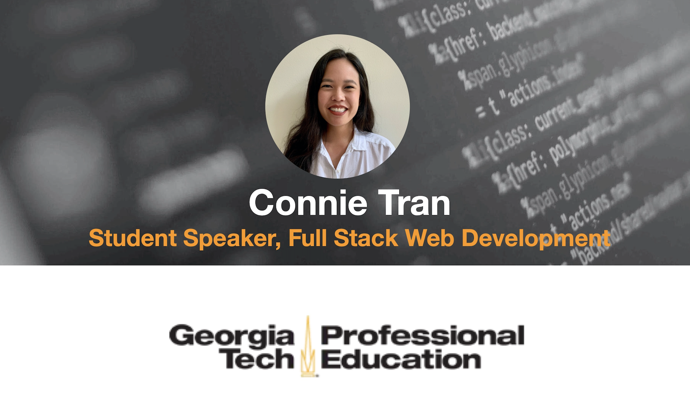

# Georgia Tech Bootcamp 2020 - Graduation Speech

 

This is a speech I wrote for the Georgia Tech August 2020 graduating class in Full-Stack Web Development.

These were the "notes" I referred to as I gave my speech, so some of the writing has been modified as such.

Thank you to everyone who made this possible. And congratulations to this special class of software developers. I hope you look back on this chapter with pride. 

A recording of our graduation ceremony can be found here: [Georgia Tech Web Development August 2020 Graduation](https://zoom.us/rec/play/6Zx_cuyg-jw3HIKUsASDBKAqW9TvJvms0nVIrKIEy0fkUSFXMFTyNbAaZuVimZt1bYEYB8cgBj32D3Y7?continueMode=true&_x_zm_rtaid=nwoyVmQQTVaAc19HRVitmg.1597772582136.11f0b5cf4b530f0a754dc9038fff0c7d&_x_zm_rhtaid=846)

## Speech

First, I am honored and thankful to be able to speak on such a special day. I’ve got some notes here. 

Second, I want to thank the people who have made this day possible. I want to thank:
* Lauren Northcut, TA,
* Barry Ervin, TA,
* Jesse Schimmel, TA,
* Bernard Augustin, Student Success Manager, and of course, 
* Stanley Lewis, instructor, for everything you have done for us during these last 6 months. 

Your dedication to us really means so much. And we’re so thankful that you chose to share your knowledge with us.

I’d like to take today to:
* Look back on who we were before the bootcamp started,
* Celebrate what we’ve been through, and
* Look to what the future holds for us.

For most of us, this was not something we *had* to do, like high school or college. This bootcamp was something we *chose* to do for a dream we had. But our favorite movie star, Denzel Washington, says [we mention him a lot :) ]: 

> Nothing in life is worthwhile unless you take risks. 

This bootcamp is something we chose to dedicate our time to.

In March earlier this year, I remember driving to Georgia Tech, finding parking, three times a week and seeing you all in person. I know all of us have busy lives outside of class. Back then, I wished I had more time in my day to balance everything. During those first few weeks of feeling the excitement of being able to build something even with just HTML and CSS, I wished I could work remotely so I could spend more time coding.

I’m sure we’ve all had our own moments of self doubt in this course. I journal a lot so I can commemorate different times in my life. In April, I wrote - 

“I feel behind in my prework. I’m not good enough at coding to contribute to actual projects in the real-world. I don’t feel 100% confident in my coding or skills.”

Then COVID-19 happened. I remember when Bernard [our Student Success Manager] walked in and told us that Georgia Tech was closing its campus. I was shocked, and honestly, scared. I didn’t know what would happen next.

And so just like that, my wish to work remotely was granted. At first, I think it was hard for all of us to get used to being online. We were already busy before the pandemic with balancing our personal lives, our jobs, and our families, and on top of all that, we had to deal with a new pandemic that had so many unknowns. I wondered what would happen *next* every day.

But now it’s August. And we’re graduating today. We came together every Tuesday, Thursday, and Saturday for *hours*. We did that every *single* week for 6 months straight. That is dedication and discipline.

Before the bootcamp started, we did prework. The prework asked WHAT you wanted to achieve. So I wrote down the most important thing I wanted to learn from this bootcamp: 

I want to be able to code a website from scratch that I’m proud of. 

That was 6 months ago. 

HTML and Javascript were invented in the 1990s. We have basically learned everything that has happened on the web since then in 6 months. In 6 months, we have learned all of the innovations in web technologies that have occurred in the last 20 years. Before this bootcamp, I didn’t even know how to navigate to a folder in the Terminal and now we’re coding in React. I had always dreamt of learning Node, of how to build my own database, and of learning Javascript - one of the most popular programming languages in the world today.

Now, I laugh at my simple goal of coding a website, because we achieved that in the few first weeks of the bootcamp and did it 10 times over with every homework assignment and every project.

So, I ask, who are we today?

I hope you look back on the person you thought you would become today. Not only did the prework ask us to create successful habits, but it also asked us WHO we wanted to become. 6 months ago, I wrote down traits that I thought makes someone a good developer:

> Someone actually codes, not just talks about it. Someone who’s motivated and disciplined. Someone who is not afraid of throwing away bad code or afraid of failure. Someone who is always learning new technologies. Humble, always trying to improve.

I realize I have already been practicing these traits for the last 6 months. We’re no longer trying to become developers. Just like an artist is an artist, by painting, or a writer is a writer, by writing; we have *become* developers *through doing*. And we walk away today as software developers.

I think this pandemic has made us stronger people and stronger *developers*. We now part of a special group of people in the world who create things, but we are also part of a special *subset* of developers. We know the grit it takes to persevere even if there is a global pandemic affecting the entire world, even today.

Our job is *not* to code. It is to take dreams that are in someone’s head and turn them into reality. Completing this bootcamp is proof that you are capable of realizing your own dreams. For many of you, this was a dream you’ve had for a long time. For me, it’s a dream I’ve had for years. Today we have achieved that dream.

But success is not *final*. Technology will always continue changing. Your mission now is to dive deeper into this craft and continue developing yourself as if you were that person 6 months ago. 

Remember that before this bootcamp started, you knew nothing, but you had passion. Completing this bootcamp is proof that you are capable of learning anything you want even if you know nothing. 

So, I challenge you to know more than you did yesterday [we talk about this as a major goal of the bootcamp :)], every day, 6 months from now and for the rest of your life. Because the only thing you walk away with today is yourself and the knowledge the person 6 months ago -- gave to you today.

Thank you, Stanley, for sharing everything you know with us and teaching us decades of knowledge in 6 months. You have helped us become software developers and because of that we are better people.
